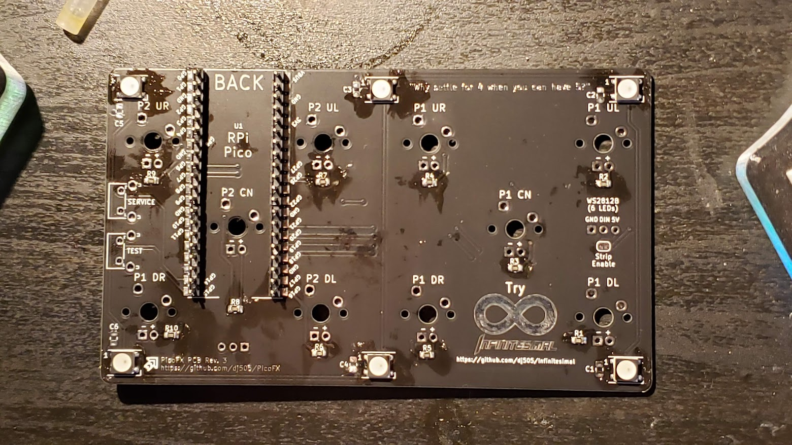

# PicoFX
A compact, feature-rich keyboard-style controller for Pump it Up simulators

## Components
Many components listed below are optional. If you prefer to spend as little as possible on this build, they can be entirely omitted. In the case of the FR4 plate, leaving it out will require you to 3D print or laser cut a plate/case.

- [Raspberry Pi Pico](https://www.digikey.ca/en/products/detail/raspberry-pi/SC0915/13624793) (**Not** Pico H, nothing with pre-soldered headers!)
  - A Pico W should also work, but this project currently has no WiFi or Bluetooth functionality. This may change in the future.
  - A Pico H would require female pin headers to be installed, as the headers are attached before the switches, but the Pico is installed after the switches. Installing the Pico too early would make 1 switch and LED impossible to solder.
- 3D printed shell (to be added to the repo later)
- 2x [right angle tactile switches](https://www.lcsc.com/product-detail/Tactile-Switches_C-K-PTS645VL392LFS_C285523.html)
- 10x MX-compatible keyboard switches of your choosing
- 10x MX-compatible keycaps, ideally a "flat" or uniform profile like DSA, XDA, F10, etc.
  - Either ten 1u caps, or eight 1.25u caps and two 1u caps for more arcade-like sizing. Up to you!
- **(OPTIONAL)** 4x M3*8mm pan head machine screws
- **(OPTIONAL)** 10x LEDs for the switches (4x red, 4x blue, 2x yellow (or whichever colours you prefer tbh))
  - 10x [330Ohm 0805 SMD resistors](https://www.lcsc.com/product-detail/Chip-Resistor-Surface-Mount_UNI-ROYAL-Uniroyal-Elec-0805W8F3300T5E_C17630.html) - only needed if using the above LEDs
- **(OPTIONAL)** 6 [WS2812B LEDs](https://www.lcsc.com/product-detail/Light-Emitting-Diodes-LED_Worldsemi-WS2812B-B-W_C2761795.html) for underglow lighting
  - Option 1: There are foorprints for 6 individual WS2812B LEDs **(PLCC4, 5x5mm)** around the perimiter of the case. There are hand-solder friendly 0805 capacitor footprints beside each LED, but these are only needed if you run into issues with the LEDs being unstable or acting erratically. This option will likely look nicer, but may be more difficult for beginners to solder.
  - Option 2: A regular WS2812B strip cut down to 6 LEDs in length can be soldered to the three pins on the left hand side of the board (from the back) and adhered along the length of the PCB. This option is more friendly to beginners or those who aren't as confident with SMD soldering, but the lighting it provides isn't quite as even. **Requires jumping the "Strip Enable" pad.**

- 1x Main PCB
- **(OPTIONAL but recommended)** 1x FR4 plate

Feel free to use whichever switches and keycaps you want, as long as they're Cherry MX compatible!

## How To Build
This build applies to the **full materials list**, including the FR4 plate and surface mount parts. Text descriptions will be provided for the optional alternatives, such as replacing SMD LEDs with LED strips or skpping the FR4 plate. Be sure to read through each step in its entirety before doing anything!

1. **Solder the WS2812B LEDs in place.** If using an LED strip, skip this step and wait until step 9. The notch present on each LED should be positioned on the bottom right side. These can be finicky to solder - don't heat them for too long!

2. **Solder the SMD resistors in place.** The footprints used for these are made with hand soldering in mind, but if you have a hot air rework station, reflow oven, or any other fancy tools at your disposal, those work great too. If you don't feel comfortable soldering these, you *can* skip them and bridge the pads with solder, but it's not good practice.

3. **Solder in the pin headers.** It doesn't really matter which orientation you use, but if you insert the **short** pins through the PCB (unlike what I did here) you can avoid some extra trimming. Inserting the long side through the PCB will require trimming on the other side to make sure there's enough clearance to mount the switches. **Do NOT solder the Pico yet.**

4. **If using the FR4 plate, solder in the other, smaller pin headers.** These go on the **FRONT** side of the board and connect with the top plate, so make sure the **long** side is facing up, as shown.

5. **Mount the switches in the plate. Mount the plate on the main PCB.** Before you solder, make sure no legs are bent under the PCB and all of them are poking through the solder pads. Also insert and solder the LEDs one at a time. Pro tip - test your LEDs and make sure that they both work and are the right colour before soldering them in! The longer leg (cathode) is marked "+" with a round hole, and the shorter leg (anode) is marked "-" with a square hole. **Note: if your switches require LEDs to be mounted underneath, make sure to insert those first.**

6. **Solder the test and service buttons.** If you **are** using the FR4 plate, make sure you solder these to the holes on the plate as shown below. In either configuration, the switches should end up on the bottom of the PCB, not sticking out the top. To avoid sharp solder spikes, consider trimming the legs flush before soldering.

7. **Solder the pin headers for the test and service buttons** if you haven't done so already. As with the previous step, consider trimming the pins flush before soldering to avoid sharp solder spikes.

8. **Install the Raspberry Pi Pico.** The fun part! Simply place it on the pin headers and solder each pin in place.

9. **If you didn't surface mount solder the WS2812B LEDs and opted for a strip**, cut the strip to a length of 6 LEDs. You may need to trim the legs of the LEDs along the bottom of the board so the LED strip can sit flat and stick properly. Jump the 2 pads labelled "Strip Enable" with a blob of solder, and wire up the LED strip to the corresponding pads. Ensure you're soldering to the "DI" or "DIN" pin on the LED strip! If you solder to "DO" or "DOUT" then your LEDs will not light up. (Note: lengths longer than 6 LEDs will work but may exceed the standard USB 500mA current draw and will require changes to the firmware.)

You're done! Flash the firmware, install the bottom half of the case, and you're good to go.

## Flashing the Firmware

[**Prebuilt PIUIO firmwares here!**](https://github.com/48productions/piuio-pico/releases/tag/v1.0.0)

For the time being, see the [piuio-pico](https://github.com/48productions/piuio-pico/) repository by [48productions](https://github.com/48productions). This firmware emulates a PIUIO board and can be used on Windows devices via IO2Key ([helpful installation video](https://www.youtube.com/watch?v=xo5m9dlNFfY) by Nirvash) or on Linux via a [custom kernel driver](https://github.com/DinsFire64/piuio) (installation instructions in the README). ***Do not*** use this firmware on any hand controller to play the latest official game online! It is considered cheating and you will be banned. Using any aspect of this project for prohobitied play on officially supported games is not endorsed, encouraged, or supported. However, do feel free to use this firmware to build a proper dance pad.

To install the firmware, plug in your Raspberry Pi Pico while holding the "BOOTSEL" button to put it in programming mode. It should show up as a USB mass storage device. Compile the firmware (if necessary) and copy the .uf2 file onto the Pico through the file explorer. It should automatically disconnect itself and restart. You're done!

Dedicated HID controller firmware for simulators and such coming Eventually™

## Special Thanks
Thanks to
- therathatter & 48productions (firmware things)
- SpaghettiSnail (putting up with my KiCad woes)
- BedrockSolid (KiCad and component sourcing advice)
- Everyone else who supported and contributed to the project!
