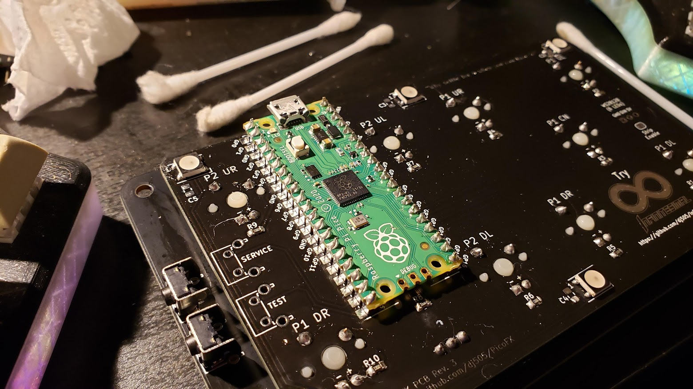

# PicoFX
A compact, feature-rich keyboard-style controller for Pump it Up simulators

[See it in action!](https://www.youtube.com/watch?v=75ObKhgJE3M)

## Table of Contents
This readme may be rather large, but don't let that intimiate you! I've included as much information as possible to make sure this build is straightforward and beginner friendly. If you have any questions at all, feel free to shoot me a message through Discord (dj505#6697) or open an issue here.
* [Component List](#components)
* [Ordering the PCBs](#ordering-the-pcbs) (for first time/inexperienced builders)
* [Ordering components](#ordering-components) (for first time/inexperienced builders)
* [How to Build](#how-to-build)
* [Flashing the Firmware](#flashing-the-firmware)
* [FAQ](#faq)

## Components
Many components listed below are optional. If you prefer to spend as little as possible on this build, they can be entirely omitted. In the case of the FR4 plate, leaving it out will require you to 3D print or laser cut a plate/case.  
All prices below reflect the bare minimum cost of building **5 controllers** with PCBs and components from **JLCPCB and LCSC** respectively, as the minimum number of PCBs from JLCPCB per deisgn is 5. Some components link to AliExpress as it's generally a good, cheap source for keycaps, switches, and other components LCSC won't have, at the cost of long shipping times. It's highly recommended to buy a few extra of each component in case any are damaged, lost, or DOA.

| Part (per 1 controller) | Specs | Notes | Recommended Purchase Link | Approximate Min. Cost (USD) |
|-------------------------|-------|-------|---------------------------|-----------------------------|
|Raspberry Pi Pico|Any Pico that is **not** the Pico H|No pre-soldered headers. Pico W should work, but there is currently no WiFi or Bluetooth functionality here. This may change in the future. Pin-compatible clones should work (in case you want USB C) - **be sure** that the pin mappings are the same! These are not officially supported and it's up to you to make sure it works.|[Link](https://www.digikey.ca/en/products/detail/raspberry-pi/SC0915/13624793)|$4|
|3D printed shell|N/A|Cost depends on whether or not you own a 3D printer (or know someone who does) and what service you use.|N/A - STL file located in `Case/3D Prints` directory|N/A|
|2x right angle tactile switches|Approx. 7.5x6mm, right angle. See recommended purchase link|Recommendation - buy a couple extras just in case.|[Link](https://www.lcsc.com/product-detail/Tactile-Switches_C-K-PTS645VL392LFS_C285523.html)|$0.96|
|10x keyboard switches|Must be Cherry MX compatible|The ones linked here are what I used personally for the sake of a price estimate. You can pick any kind of switch you want. Ensure the switches you choose will accommodate the LEDs you pick!|[Link](https://www.aliexpress.com/item/1005003810967081.html)|$23.99|
|10x keycaps|Must be Cherry MX compatible|Ideally a "flat" or uniform profile like DSA, XDA, F10, etc. Recommendation - source these on your own for better quality and prices.|[Link](https://www.aliexpress.com/item/32830177884.html)|$28.50|
|4x machine screws|M3\*8mm, pan head|Black would look nice if you can source some. Countersunk screws will not sit flush, and it's not advisable to countersink fiberglass without amazing ventilation and a mask with filters. Recommendation - buy a couple extras just in case.|[Link](https://www.aliexpress.com/item/32811037821.html)|$1.45|
|**(OPTIONAL)** 10x LEDs|4x red, 4x blue, 2x yellow (or whichever colours you prefer tbh)|LEDs should be 3mm or smaller to fit your switches! Recommendation - source these yourself or find alternatives through LCSC. Buy a couple extras just in case.|[Link](https://www.aliexpress.com/item/32685621460.html)|$3.29|
|10x resistors|Surface mount, 330Ohm, 0805 package|Only needed if using the above LEDs. Recommendation - buy a ton of them. They cost fractions of a cent each, and they're easy to lose!|[Link](https://www.lcsc.com/product-detail/Chip-Resistor-Surface-Mount_UNI-ROYAL-Uniroyal-Elec-0805W8F3300T5E_C17630.html)|$0.17|
|**(OPTIONAL)** 6 WS2812B LEDs\*|Must be WS2812**B** or pin-compatible. Earlier WS2812 (non-B) LEDs with 6 pins will not work.|Used for underglow lighting. **Definitely** buy extras - they're somewhat delicate and easy to break or burn out by mistake during installation.|[Link](https://www.lcsc.com/product-detail/Light-Emitting-Diodes-LED_Worldsemi-WS2812B-B-W_C2761795.html)|$4.43|
|Main PCB|1.6mm thickness, lead-free HASL or ENIG finish recommended|Estimated price based on default options, but with a **lead-free HASL finish**.|[Link](https://cart.jlcpcb.com/quote?orderType=1&stencilLayer=2&stencilWidth=100&stencilLength=100&stencilCounts=5) - gerber.zip located in `gerber` directory|$8.40|
|**(OPTIONAL but recommended)** FR4 plate|1.6mm thickness, lead-free HASL finish recommended|Estimated price based on default options, but with a **lead-free HASL finish**. Not enough contacts or mask artwork to justify ENIG finish.|[Link](https://cart.jlcpcb.com/quote?orderType=1&stencilLayer=2&stencilWidth=100&stencilLength=100&stencilCounts=5) - gerber.zip located in `Case/Plate/gerber` directory|$9.30|
|_**Total Cost**_||This cost estimate reflects building **5 full PicoFX controllers**. If you're splitting the cost through a group buy, divide it by the number of people participating.||$84.89|

\* There are a few options for RGB underglow depending on your needs and experience.  
- Option 1: There are foorprints for 6 individual WS2812B LEDs **(PLCC4, 5x5mm)** around the perimiter of the case. There are hand-solder friendly 0805 capacitor footprints beside each LED, but these are only needed if you run into issues with the LEDs being unstable or acting erratically. This option will likely look nicer, but may be more difficult for beginners to solder.
- Option 2: A regular WS2812B strip cut down to 6 LEDs in length can be soldered to the three pins on the left hand side of the board (from the back) and adhered along the length of the PCB. This option is more friendly to beginners or those who aren't as confident with SMD soldering, but the lighting it provides isn't quite as even. **Requires jumping the "Strip Enable" pad.**

If you have any questions about the parts requirements, costs, or sourcing components, feel free to shoot me a message through Discord (dj505#6697) or open an issue here.

## Ordering the PCBs
If you've never ordered PCBs before, don't worry! The process is super simple on most websites. These instructions are here to make sure each step is clear and straightforward, and to avoid accidentally ordering a set of boards with the wrong options. Keep in mind, most manufacturers have a **minimum order number of 3-5**, which means you're going to need to order at least 3-5 of each PCB (main board and plate). **Feel free** to put together a group order with friends or sell the extras! I really don't mind others making and selling units, just make sure they're well made, thoroughly tested, and work properly (and consider [donating a couple bucks](https://ko-fi.com/dj505piu) if you can!)
Here are my recommendations:
| Manufacturer | Minimum order number | Notes |
|--------------|----------------------|-------|
|JLCPCB        |5 per PCB             |New users get a reasonably large discount on their first few orders, unless this has changed since I used up all of mine. Easy quote/ordering process, most options are autodetected from the gerber file.|
|PCBWay        |5 per PCB             |PCBWay also gives new users a reasonable discount on their first order. Unsure of the specifics, haven't used them yet. More options need to be manually specified during the quote/order process than with JLC.|
|OSH Park      |3 per PCB             |Fewer options than the above two, but the minimum order number is smaller. Colour options are limited to purple and "after dark", a clear solder mask over black substrate so all the traces are visible. Overall a bit more costly, but shipping is generally as they're based in the United States.|

PCBWay and some other manufacturers will likely need you to manually specify the PCB dimensions. To save you some time, here are the dimensions for both PCBs:
| PCB | Width | Height |
|-----|-------|--------|
|Main board|120.7|70.6 mm|
|Plate|139.1 mm|77.2 mm|

The ordering process generally looks something like this:
1. Download the gerber(s) you plan to order. The main PCB can be found in this repository's main "gerber" folder and is titled "gerber.zip". Download it and ideally rename it to something like "main_board.zip" or anything that makes it clear which specific board it's for. If you plan to use the plate as well, browse to the "Case" folder, then to "Plate" and "gerber" where you can find the gerber.zip for the plate. Download and rename it accordingly as well. **None of the other files are needed - just the zip files.**
2. Visit the manufacturer's website and look for the "Get Quote" or "Instant Quote" button, or a drag-and-drop section you can upload the gerber file to. Most sites generally only accpet one gerber at a time. Some sites have a "Different Design" option you may be tempted to set to "2" if you're ordering both boards - there's no need to do this. It makes the process more complicated and possibly more expensive. Simply add both PCBs to your cart individually and order them together once they're in there.
3. Punch in the necessary options. The majority of these don't need to be changed and you can leave them be, however I recommend making sure the following are correct for **both** PCBs:
    * PCB thickness: 1.6
    * Surface Finish: LeadFree HASL **OR** ENIG (gold finish, more expensive but really cool and higher quality, but only recommended for the main PCB as the plate doesn't have enough solder points to warrant it)
    * Copper Weight: 1oz
    * You can pick whichever solder mask colour you want - this is the colour your final boards will appear. If you want, you can have different colours for the main PCB and the plate!
4. **Recommended, but optional** - For the main board, you may want to add a note to the order to clarify that one of the design choices used by the keyboard switch footprint is intentional. The top layer's solder points are covered by solder mask to give it a cleaner look, as no soldering will ever be done on that side. JLCPCB calls this option "PCB Remark" and you can find it near the bottom of the page. The message I personally added to my order was
    * `The pads covered by solder mask on the top layer are OK and are an intended part of the design.`
5. Finally, add your order to your cart! Once you have your desired orders ready, the rest of the process is identical to any other online shopping site. Pick your shipping option, pay, and you're good to go!

## Ordering components
To make sourcing a little easier and cheaper, you can find all the small components for this project on [LCSC](https://lcsc.com). This doesn't include more specialized or larger parts such as keyboard switches, or hardware such as keycaps or screws.  
The bare minimum numbers of each part per controller are listed below, but I would **highly recommend** ordering a few extras of each, as they're very small and can be easily lost or damaged. Thankfully they're very inexpensive and adding extras will only cost you a few cents to a dollar more. See the [Components section](#components) for a recap of what is/isn't optional and the alternatives for each.  
* 6 x [WS2812B RGB LED](https://lcsc.com/product-detail/Light-Emitting-Diodes-LED_Worldsemi-WS2812B-B-W_C2761795.html) (3 extra recommended per controller)
* 10 x [0805 330ohm SMD resistor](https://lcsc.com/product-detail/Chip-Resistor-Surface-Mount_UNI-ROYAL-Uniroyal-Elec-0805W8F3300T5E_C17630.html) (5 extra recommended per controller but they're so cheap you can order literally hundreds for well under a dollar total)
* 2 x [right angle tactile switches](https://lcsc.com/product-detail/Tactile-Switches_C-K-PTS645VL392LFS_C285523.html) (1 extra recommended per controller at most, they're super easy to solder but it would suck if one arrived damaged or DOA)

## How To Build
This build applies to the **full materials list**, including the FR4 plate and surface mount parts. Text descriptions will be provided for the optional alternatives, such as replacing SMD LEDs with LED strips or skpping the FR4 plate. Be sure to read through each step in its entirety before doing anything!

1. **Solder the WS2812B LEDs in place.** If using an LED strip, skip this step and wait until step 9. The notch present on each LED should be positioned on the bottom right side. These can be finicky to solder - don't heat them for too long!

2. **Solder the SMD resistors in place.** The footprints used for these are made with hand soldering in mind, but if you have a hot air rework station, reflow oven, or any other fancy tools at your disposal, those work great too. If you don't feel comfortable soldering these, you *can* skip them and bridge the pads with solder, but it's not good practice.

3. **Solder in the pin headers.** It doesn't really matter which orientation you use, but if you insert the **short** pins through the PCB (unlike what I did here) you can avoid some extra trimming. Inserting the long side through the PCB will require trimming on the other side to make sure there's enough clearance to mount the switches. **Do NOT solder the Pico yet.** Optionally, if you don't have pin headers, you can use diole legs instead, or skip this step entirely and surface mount the Pico. This is not recommended, however, beacuse it may require trimming the switch step to ensure there's clearance, and absolutely requires trimming the LED/switch legs flush. Do this at your own risk.

4. **If using the FR4 plate, solder in the other, smaller pin headers.** These go on the **FRONT** side of the board and connect with the top plate, so make sure the **long** side is facing up, as shown.

5. **Mount the switches in the plate. Mount the plate on the main PCB.** Before you solder, make sure no legs are bent under the PCB and all of them are poking through the solder pads. Also insert and solder the LEDs one at a time. Pro tip - test your LEDs and make sure that they both work and are the right colour before soldering them in! The longer leg (positive) is marked "+" with a round hole, and the shorter leg (negative) is marked "-" with a square hole. **Note: if your switches require LEDs to be mounted underneath, make sure to insert those first.**

6. **Solder the test and service buttons.** If you **are** using the FR4 plate, make sure you solder these to the holes on the plate as shown below. In either configuration, the switches should end up on the bottom of the PCB, not sticking out the top. To avoid sharp solder spikes, consider trimming the legs flush before soldering.

7. **Solder the pin headers for the test and service buttons** if you haven't done so already. As with the previous step, consider trimming the pins flush before soldering to avoid sharp solder spikes.

8. **Install the Raspberry Pi Pico.** The fun part! Simply place it on the pin headers and solder each pin in place.

9. **If you didn't surface mount solder the WS2812B LEDs and opted for a strip**, cut the strip to a length of 6 LEDs. You may need to trim the legs of the LEDs along the bottom of the board so the LED strip can sit flat and stick properly. Jump the 2 pads labelled "Strip Enable" with a blob of solder, and wire up the LED strip to the corresponding pads. Ensure you're soldering to the "DI" or "DIN" pin on the LED strip! If you solder to "DO" or "DOUT" then your LEDs will not light up. (Note: lengths longer than 6 LEDs will work but may exceed the standard USB 500mA current draw and will require changes to the firmware.)

You're done! Flash the firmware, install the bottom half of the case, and you're good to go.

## Flashing the Firmware

[**Prebuilt PIUIO firmwares here!**](https://github.com/48productions/piuio-pico/releases/tag/v1.0.0)

[**Prebuilt HID gamepad/keyboard firmware here!**](https://github.com/dj505/Pico-Game-Controller-PicoFX/releases/tag/v1.0.0)

For the PIUIO firmware source, see the [piuio-pico](https://github.com/48productions/piuio-pico/) repository by [48productions](https://github.com/48productions). This firmware emulates a PIUIO board and can be used on Windows devices via IO2Key ([helpful installation video](https://www.youtube.com/watch?v=xo5m9dlNFfY) by Nirvash) or on Linux via a [custom kernel driver](https://github.com/DinsFire64/piuio) (installation instructions in the README). ***Do not*** use this firmware on any hand controller to play the latest official game online! It is considered cheating and you will be banned. Using any aspect of this project for prohobitied play on officially supported games is not endorsed, encouraged, or supported. However, do feel free to use this firmware to build a proper dance pad.

If you plan to use this controller with simulators exclusively, see the HID gamepad/keyboard firmware linked above.

To install the firmware, plug in your Raspberry Pi Pico while holding the "BOOTSEL" button to put it in programming mode. It should show up as a USB mass storage device. Compile the firmware (if necessary) and copy the .uf2 file onto the Pico through the file explorer. It should automatically disconnect itself and restart. You're done!

## FAQ
* Can I make and sell these, or sell extras?
    * Go ahead! However, do make sure they're well built and thoroughly tested, and consider [donating a few bucks](https://ko-fi.com/dj505piu) if you can!
* Does this work with official games?
    * Yes, **however** using a hand controller on any currently online and supported game (XX 20th Anniversary Edition, at the time of writing) is considered cheating, especially during events, and you may get the game/machine banned or blacklisted.
* Can I make this without any LEDs to start with and add them later?
    * Mostly. There is one in-switch LED that won't be reachable once the Pico is soldered in. If you plan to add LEDs later on, either install sockets of some kind to account for this without needing to solder later, or install the Pico with male/female pin headers so you can remove it later to install LEDs. All RGB LEDs can be soldered at any time without removing the Pico.
* How do I make the underglow work?
    * If you're using this controller with IO2Key on Windows for StepF2/StepP1/StepPrime/StepPXX, underglow lighting will not work. Base StepMania or Project OutFox support lighting but extra manual configuration will need to be done, which I haven't had a chance to try yet. Linux users running StepMania or Project OutFox can use the kernel driver linked in [Flashing the Firmware](#flashing-the-firmware) for lighting support by editing Preferences.ini and editing the `LightsDriver` line to read `LightsDriver=PIUIO_Leds`.
* Can I make this project USB C compatible somehow?
    * If you can find a Pico clone that uses USB C and is pin-compatible with the official Raspberry Pi Pico, you absolutely can. I can't provide official support for multiple boards though, otherwise this project would get really messy really fast.
* Can I build one of these without a PCB?
    * Absolutely! Check out the "3D Prints" folder for 3D printable cases and plates. Be prepared to do a lot of tedious wire management and soldering, though! You'll also need to figure out how to mount the test and service buttons on your own.

## Special Thanks
Thanks to
- therathatter & 48productions (firmware things)
- SpaghettiSnail (putting up with my KiCad woes)
- BedrockSolid (KiCad and component sourcing advice)
- Everyone else who supported and contributed to the project!
